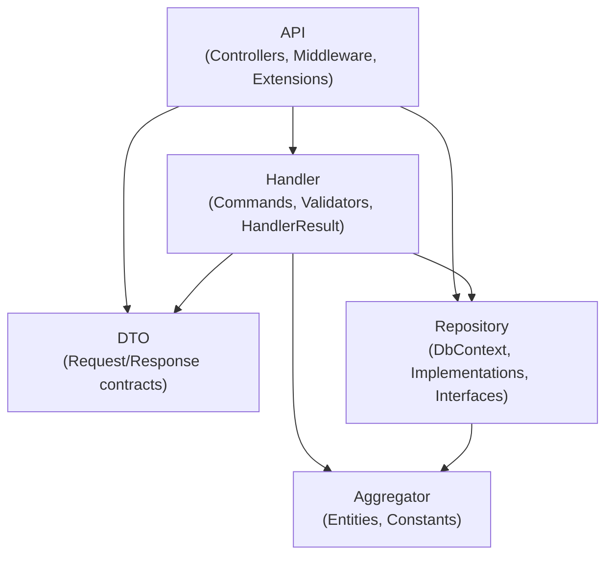

# Walkthrough — Create Employee CQRS Migration

## Summary

Migrated the **Create Employee** use case from the existing 3-tier architecture to the new 5-project CQRS/Clean Architecture. All code was ported from the latest `3-tier project updated/` folder as the source of truth.

## Architecture



## Changes by Project

### EmployeeManagement.Aggregator (0 dependencies)

| Action | File |
|---|---|
| NEW | [Employee.cs](file:///f:/repo/hr-platform/EmployeeManagement.Aggregator/Entities/Employee.cs) |
| NEW | [Department.cs](file:///f:/repo/hr-platform/EmployeeManagement.Aggregator/Entities/Department.cs) |
| NEW | [User.cs](file:///f:/repo/hr-platform/EmployeeManagement.Aggregator/Entities/User.cs) |
| NEW | [Roles.cs](file:///f:/repo/hr-platform/EmployeeManagement.Aggregator/Constants/Roles.cs) |
| NEW | [Gender.cs](file:///f:/repo/hr-platform/EmployeeManagement.Aggregator/Constants/Gender.cs) |
| NEW | [EmployeeStatus.cs](file:///f:/repo/hr-platform/EmployeeManagement.Aggregator/Constants/EmployeeStatus.cs) |
| NEW | [EmploymentType.cs](file:///f:/repo/hr-platform/EmployeeManagement.Aggregator/Constants/EmploymentType.cs) |
| DELETE | `Class1.cs` |

---

### EmployeeManagement.DTO (0 dependencies)

| Action | File |
|---|---|
| NEW | [CreateEmployeeRequest.cs](file:///f:/repo/hr-platform/EmployeeManagement.DTO/Employee/CreateEmployeeRequest.cs) |
| NEW | [EmployeeResponse.cs](file:///f:/repo/hr-platform/EmployeeManagement.DTO/Employee/EmployeeResponse.cs) |
| NEW | [ApiErrorResponse.cs](file:///f:/repo/hr-platform/EmployeeManagement.DTO/Common/ApiErrorResponse.cs) |

---

### EmployeeManagement.Repository (depends on: Aggregator)

| Action | File |
|---|---|
| MODIFY | [EmployeeManagement.Repository.csproj](file:///f:/repo/hr-platform/EmployeeManagement.Repository/EmployeeManagement.Repository.csproj) |
| NEW | [IGenericRepository.cs](file:///f:/repo/hr-platform/EmployeeManagement.Repository/Interfaces/IGenericRepository.cs) |
| NEW | [IEmployeeRepository.cs](file:///f:/repo/hr-platform/EmployeeManagement.Repository/Interfaces/IEmployeeRepository.cs) |
| NEW | [IDepartmentRepository.cs](file:///f:/repo/hr-platform/EmployeeManagement.Repository/Interfaces/IDepartmentRepository.cs) |
| NEW | [IUserRepository.cs](file:///f:/repo/hr-platform/EmployeeManagement.Repository/Interfaces/IUserRepository.cs) |
| NEW | [GenericRepository.cs](file:///f:/repo/hr-platform/EmployeeManagement.Repository/Implementations/GenericRepository.cs) |
| NEW | [EmployeeRepository.cs](file:///f:/repo/hr-platform/EmployeeManagement.Repository/Implementations/EmployeeRepository.cs) |
| NEW | [DepartmentRepository.cs](file:///f:/repo/hr-platform/EmployeeManagement.Repository/Implementations/DepartmentRepository.cs) |
| NEW | [UserRepository.cs](file:///f:/repo/hr-platform/EmployeeManagement.Repository/Implementations/UserRepository.cs) |
| NEW | [EmployeeDbContext.cs](file:///f:/repo/hr-platform/EmployeeManagement.Repository/Data/EmployeeDbContext.cs) |
| NEW | [DependencyInjection.cs](file:///f:/repo/hr-platform/EmployeeManagement.Repository/DependencyInjection.cs) |
| DELETE | `Class1.cs` |

---

### EmployeeManagement.Handler (depends on: Aggregator, DTO, Repository)

| Action | File |
|---|---|
| MODIFY | [EmployeeManagement.Handler.csproj](file:///f:/repo/hr-platform/EmployeeManagement.Handler/EmployeeManagement.Handler.csproj) |
| NEW | [HandlerResult.cs](file:///f:/repo/hr-platform/EmployeeManagement.Handler/Common/HandlerResult.cs) |
| NEW | [CreateEmployeeCommand.cs](file:///f:/repo/hr-platform/EmployeeManagement.Handler/Commands/CreateEmployee/CreateEmployeeCommand.cs) |
| NEW | [CreateEmployeeHandler.cs](file:///f:/repo/hr-platform/EmployeeManagement.Handler/Commands/CreateEmployee/CreateEmployeeHandler.cs) |
| NEW | [CreateEmployeeRequestValidator.cs](file:///f:/repo/hr-platform/EmployeeManagement.Handler/Validators/CreateEmployeeRequestValidator.cs) |
| NEW | [DependencyInjection.cs](file:///f:/repo/hr-platform/EmployeeManagement.Handler/DependencyInjection.cs) |

---

### EmployeeManagement.API (depends on: Handler, DTO, Repository)

| Action | File |
|---|---|
| MODIFY | [EmployeeManagement.API.csproj](file:///f:/repo/hr-platform/EmployeeManagement.API/EmployeeManagement.API.csproj) |
| MODIFY | [Program.cs](file:///f:/repo/hr-platform/EmployeeManagement.API/Program.cs) |
| MODIFY | [appsettings.json](file:///f:/repo/hr-platform/EmployeeManagement.API/appsettings.json) |
| NEW | [EmployeeController.cs](file:///f:/repo/hr-platform/EmployeeManagement.API/Controllers/EmployeeController.cs) |
| NEW | [AuthenticationExtensions.cs](file:///f:/repo/hr-platform/EmployeeManagement.API/Extensions/AuthenticationExtensions.cs) |
| NEW | [SwaggerExtensions.cs](file:///f:/repo/hr-platform/EmployeeManagement.API/Extensions/SwaggerExtensions.cs) |
| NEW | [FluentValidationExtensions.cs](file:///f:/repo/hr-platform/EmployeeManagement.API/Extensions/FluentValidationExtensions.cs) |
| NEW | [ExceptionHandlingMiddleware.cs](file:///f:/repo/hr-platform/EmployeeManagement.API/Middleware/ExceptionHandlingMiddleware.cs) |
| DELETE | `WeatherForecast.cs` |
| DELETE | `Controllers/WeatherForecastController.cs` |

## Key Design Decisions

| Decision | Rationale |
|---|---|
| **No UnitOfWork** | Intentionally removed per Team Lead directive. Each repo calls `SaveChangesAsync` independently. |
| **User + Employee creation is NOT atomic** | Two separate `SaveChangesAsync` calls — matches latest 3-tier behavior. |
| **No migrations created** | Existing DB and migration history preserved. Strategy decided separately. |
| **Validators in Handler project** | Validators define rules for command DTOs; API scans the Handler assembly. |
| **JWT secret from appsettings** | Simpler than DotNetEnv for development. Can switch to env variable later. |
| **Handler calls repositories via interfaces** | Handler never touches DbContext or EF Core directly. |
| **Aggregator is persistence-ignorant** | Zero project references, zero NuGet packages. Same entities used by EF Core via Repository. |
| **Command wraps DTO** | `CreateEmployeeCommand` wraps `CreateEmployeeRequest` — allows future Dispatcher insertion. |

## Verification

```
Build succeeded.
    0 Warning(s)
    0 Error(s)
```

All 5 projects compile cleanly with correct dependency chain.
